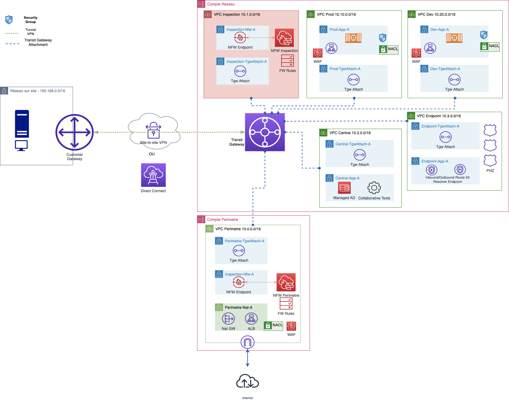

# Réseau Hybride Sécuritaire et évolutif AWS

<!-- BEGIN_TF_DOCS -->
## Requirements

| Name | Version |
|------|---------|
|  [aws](#requirement\_aws) | >= 5.12.0 |

## Providers

No providers.

## Modules

| Name | Source | Version |
|------|--------|---------|
|  [tgw\_principal](#module\_tgw\_principal) | ./modules/tgw | n/a |
|  [tgw\_route\_0](#module\_tgw\_route\_0) | ./modules/tgw-route-0 | n/a |
|  [vpc\_dev](#module\_vpc\_dev) | ./modules/vpc-dev | n/a |
|  [vpc\_endpoint](#module\_vpc\_endpoint) | ./modules/vpc-endpoint | n/a |
|  [vpc\_onprem](#module\_vpc\_onprem) | ./modules/vpc-onprem | n/a |
|  [vpc\_perimetre](#module\_vpc\_perimetre) | ./modules/vpc-perimetre | n/a |
|  [vpc\_prod](#module\_vpc\_prod) | ./modules/vpc-prod | n/a |
|  [vpn\_cloud](#module\_vpn\_cloud) | ./modules/vpn-cloud | n/a |
|  [vpn\_onprem](#module\_vpn\_onprem) | ./modules/vpn-onprem | n/a |

## Resources

No resources.

## Inputs

| Name | Description | Type | Default | Required |
|------|-------------|------|---------|:--------:|
|  [assume\_role\_network](#input\_assume\_role\_network) | Arn du role IAM a assumer pour deployer les ressources dans le compte Network (sandbox01) | `string` | n/a | yes |
|  [assume\_role\_perimetre](#input\_assume\_role\_perimetre) | Arn du role IAM a assumer pour deployer les ressources dans le compte Perimetre (sandbox02) | `string` | n/a | yes |
|  [cgw\_bgp\_asn](#input\_cgw\_bgp\_asn) | BGP ASN du Customer Gateway | `number` | n/a | yes |
|  [cloud\_cidr](#input\_cloud\_cidr) | CIDR du Cloud | `string` | n/a | yes |
|  [onprem\_region](#input\_onprem\_region) | Region AWS pour la creation des ressources On Prem | `string` | n/a | yes |
|  [ram\_principals](#input\_ram\_principals) | Une liste de principals avec lesquels partager TGW. Les valeurs possibles sont un ID de compte AWS, un ARN d'organisation AWS Organizations ou un ARN d'unité d'organisation AWS Organizations | `list(string)` | n/a | yes |
|  [region](#input\_region) | Region AWS pour la creation des ressources | `string` | n/a | yes |
|  [resource\_prefix](#input\_resource\_prefix) | Prefixe pour le nom des ressources | `string` | `"aug-sec-network"` | no |
|  [server\_vpn\_instance\_type](#input\_server\_vpn\_instance\_type) | Type de l'instance du server VPN | `string` | n/a | yes |
|  [server\_vpn\_private\_ips](#input\_server\_vpn\_private\_ips) | Liste des IP Privees du server VPN dans le subnet Public-A | `list(string)` | n/a | yes |
|  [subnet\_dev\_appa\_cidr](#input\_subnet\_dev\_appa\_cidr) | CIDR du subnet Dev-App-A | `string` | n/a | yes |
|  [subnet\_dev\_appb\_cidr](#input\_subnet\_dev\_appb\_cidr) | CIDR du subnet Dev-App-B | `string` | n/a | yes |
|  [subnet\_dev\_tgwattacha\_cidr](#input\_subnet\_dev\_tgwattacha\_cidr) | CIDR du subnet Dev-Tgwattach-A | `string` | n/a | yes |
|  [subnet\_dev\_tgwattachb\_cidr](#input\_subnet\_dev\_tgwattachb\_cidr) | CIDR du subnet Dev-Tgwattach-B | `string` | n/a | yes |
|  [subnet\_endpoint\_tgwattacha\_cidr](#input\_subnet\_endpoint\_tgwattacha\_cidr) | CIDR du subnet Endpoint-Tgwattach-A | `string` | n/a | yes |
|  [subnet\_endpoint\_tgwattachb\_cidr](#input\_subnet\_endpoint\_tgwattachb\_cidr) | CIDR du subnet Endpoint-Tgwattach-B | `string` | n/a | yes |
|  [subnet\_endpointa\_cidr](#input\_subnet\_endpointa\_cidr) | CIDR du subnet Endpoint-A | `string` | n/a | yes |
|  [subnet\_endpointb\_cidr](#input\_subnet\_endpointb\_cidr) | CIDR du subnet Endpoint-B | `string` | n/a | yes |
|  [subnet\_onprem\_privatea\_cidr](#input\_subnet\_onprem\_privatea\_cidr) | CIDR du Subnet OnPrem Private-A | `string` | n/a | yes |
|  [subnet\_onprem\_publica\_cidr](#input\_subnet\_onprem\_publica\_cidr) | CIDR du Subnet OnPrem Public-A | `string` | n/a | yes |
|  [subnet\_perimetre\_nata\_cidr](#input\_subnet\_perimetre\_nata\_cidr) | CIDR du subnet Perimetre-Nat-A | `string` | n/a | yes |
|  [subnet\_perimetre\_natb\_cidr](#input\_subnet\_perimetre\_natb\_cidr) | CIDR du subnet Perimetre-Nat-B | `string` | n/a | yes |
|  [subnet\_perimetre\_nfwa\_cidr](#input\_subnet\_perimetre\_nfwa\_cidr) | CIDR du subnet Perimetre-Nfw-A | `string` | n/a | yes |
|  [subnet\_perimetre\_nfwb\_cidr](#input\_subnet\_perimetre\_nfwb\_cidr) | CIDR du subnet Perimetre-Nfw-B | `string` | n/a | yes |
|  [subnet\_perimetre\_tgwattacha\_cidr](#input\_subnet\_perimetre\_tgwattacha\_cidr) | CIDR du subnet Perimetre-Tgwattach-A | `string` | n/a | yes |
|  [subnet\_perimetre\_tgwattachb\_cidr](#input\_subnet\_perimetre\_tgwattachb\_cidr) | CIDR du subnet Perimetre-Tgwattach-B | `string` | n/a | yes |
|  [subnet\_prod\_appa\_cidr](#input\_subnet\_prod\_appa\_cidr) | CIDR du subnet Prod-App-A | `string` | n/a | yes |
|  [subnet\_prod\_appb\_cidr](#input\_subnet\_prod\_appb\_cidr) | CIDR du subnet Prod-App-B | `string` | n/a | yes |
|  [subnet\_prod\_tgwattacha\_cidr](#input\_subnet\_prod\_tgwattacha\_cidr) | CIDR du subnet Prod-Tgwattach-A | `string` | n/a | yes |
|  [subnet\_prod\_tgwattachb\_cidr](#input\_subnet\_prod\_tgwattachb\_cidr) | CIDR du subnet Prod-Tgwattach-B | `string` | n/a | yes |
|  [tgw\_bgp\_asn](#input\_tgw\_bgp\_asn) | BGP ASN du Transit Gateway AWS | `number` | n/a | yes |
|  [vpc\_dev\_cidr](#input\_vpc\_dev\_cidr) | CIDR du VPC Dev | `string` | n/a | yes |
|  [vpc\_endpoint\_cidr](#input\_vpc\_endpoint\_cidr) | CIDR du VPC Endpoint | `string` | n/a | yes |
|  [vpc\_onprem\_cidr](#input\_vpc\_onprem\_cidr) | CIDR du VPC OnPrem | `string` | n/a | yes |
|  [vpc\_perimetre\_cidr](#input\_vpc\_perimetre\_cidr) | CIDR du VPC Perimetre | `string` | n/a | yes |
|  [vpc\_prod\_cidr](#input\_vpc\_prod\_cidr) | CIDR du VPC Prod | `string` | n/a | yes |

## Outputs

| Name | Description |
|------|-------------|
|  [central\_endpoints](#output\_central\_endpoints) | Liste des ID des PHZ |
|  [nfw\_endpoint\_1](#output\_nfw\_endpoint\_1) | ID du VPC endpoint Nfw dans la zone a |
|  [nfw\_endpoint\_2](#output\_nfw\_endpoint\_2) | ID du VPC endpoint Nfw dans la zone b |
|  [vpn\_connection\_attributes](#output\_vpn\_connection\_attributes) | Configurations du VPN Cloud |
<!-- END_TF_DOCS -->